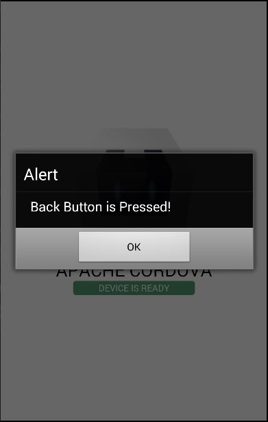
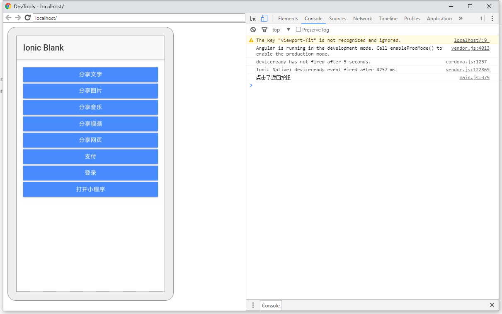

### 微信 cordova 插件 v1.0.0

    插件环境 cordova-android >= 7.0.0

#### 1.申请密钥

    请到微信开放平台 开发者应用登记页面 进行登记，登记并选择移动应用进行设置后，将该应用提交审核，只有审核通过的应用才能进行开发。

#### 2.安装插件

    cordova plugin add https://github.com/waliu/cordova-plugin-wechat-chenyu --variable WECHAT_APPID=[your key]

#### 3. 基础功能

- [x] 分享
- [x] 支付
- [x] 登录
- [x] 打开小程序

#### 4.js/ts使用方法

    //例如：
    window["WeChat"].share(option, (res) => { }, (error) => { });

- window["WeChat"].share(option,successCallback, failedCallback);
- window["WeChat"].sendPaymentRequest(option,successCallback, failedCallback);
- window["WeChat"].auth(option,successCallback, failedCallback);
- window["WeChat"].openMiniProgram(option,successCallback, failedCallback);
- window["WeChat"].onResp(successCallback);

#### 5.参数说明及调用示例

<font color=red>所有方法的调用都可以看示例文档===></font>
[示例文档](example/doc/example.md)
<br>
<font color=red>完整的示例代码(基于ionic3编写)===></font>
[示例代码](example/code)

任何方法都会返回一个正确的结果（successCallback）或者一个错误的反馈（failedCallback）

| 参数 | 类型 | 说明 |
| :----:| :----: | :----: |
|option|Option|方法所需的参数|
|successCallback|Function|方法正确运行会触发 successCallback 函数|
|failedCallback|Function|方法错误运行会触发 failedCallback 函数|

* 分享方法<br>
  window["WeChat"].share(option,successCallback, failedCallback)

option

| 参数 | 类型 | 说明 |
| :----:| :----: | :----: |
|message|mediaObject|分享的对象|
|prepayId|string|微信返回的支付交易会话ID|
|nonceStr|string|回调函数|

* 支付方法<br>
  window["WeChat"].share(option,successCallback, failedCallback)

option

| 参数 | 类型 | 说明 |
| :----:| :----: | :----: |
|partnerId|string|微信支付分配的商户号|
|prepayId|string|微信返回的支付交易会话ID|
|nonceStr|string|随机字符串，不长于32位。推荐随机数生成算法|
|timestamp|string|时间戳，请见接口规则-参数规定|
|packageValue|string|暂填写固定值Sign=WXPay|
|sign|string|签名，详见签名生成算法注意：签名方式一定要与统一下单接口使用的一致|

* 微信登录<br>
  window["WeChat"].auth(option,successCallback, failedCallback)

| 参数 | 类型 | 说明 |
| :----:| :----: | :----: |
|scope|string|应用授权作用域，如获取用户个人信息则填写 snsapi_userinfo|
|state|string|用于保持请求和回调的状态，授权请求后原样带回给第三方。该参数可用于防止 csrf 攻击（跨站请求伪造攻击），建议第三方带上该参数，可设置为简单的随机数加 session 进行校验|

* 打开小程序<br>
  window["WeChat"].openMiniProgram(option,successCallback, failedCallback);

| 参数 | 类型 | 说明 |
| :----:| :----: | :----: |
|userName|string|填小程序原始id|
|path|string|拉起小程序页面的可带参路径，不填默认拉起小程序首页，对于小游戏，可以只传入 query 部分，来实现传参效果，如：传入 "?foo=bar"。|
|miniprogramType|number|可选打开 开发版，体验版和正式版|

* <font color=red>订阅返回值</font><br>
  window["WeChat"].onResp((e) => {});<br>
  当你 登录、支付、分享、打开小程序、他都会返回一个值，标记你是否成功操作 window["WeChat"].onResp(option,successCallback, failedCallback);

| 参数 | 类型 | 说明 |
| :----:| :----: | :----: |
|successCallback|Function|当调用某个方式时，返回app时就会触发该方法|

```ts
   try {
  window["WeChat"].onResp((e) => {
    console.log(e);
    if ((e["errCode"] == -6 && (e["pluginType"] == "Share" || e["pluginType"] == "WXLaunchMiniProgram" || e["pluginType"] == "Auth")) || e["errCode"] == -1 && (e["pluginType"] == "Pay")) {
      this.presentToast("签名错误、未注册APPID、项目设置APPID不正确、注册的APPID与设置的不匹配、其他异常等")
    }
    //登录反馈
    if (e["errCode"] == -4 && e["pluginType"] == "Auth") {
      this.presentToast("登录被拒绝！")
    }
    if (e["errCode"] == 0 && e["pluginType"] == "Auth") {
      this.presentToast("登录成功")
    }
    //支付反馈
    if (e["errCode"] == -2 && e["pluginType"] == "Pay") {
      this.presentToast("无需处理。发生场景：用户不支付了，点击取消，返回APP。")
    }
    if (e["errCode"] == 0 && e["pluginType"] == "Pay") {
      this.presentToast("展示支付成功的界面！")
    }
    //分享反馈
    if (e["errCode"] == 0 && e["pluginType"] == "Share") {
      this.presentToast("用户已经完成分享了，无法判断是成功分享，还是取消的分享！")
    }
    //打开小程序反馈
    if (e["errCode"] == -3 && e["pluginType"] == "WXLaunchMiniProgram") {
      this.presentToast("小程序启动失败 （错误码:-3)")
    }
  })
} catch (e) {
  console.warn("请在Android 或者ios 上运行")
}
```

#### 6.联系我:

     QQ群 390736068

#### 7.可定制功能

- [x] 图片识别
- [x] 语音识别
- [x] 语音合成
- [x] 微信内网页跳转APP功能（可跳转到指定app界面）


#### 8.常见问题：
* 返回键问题
   - 当你打开微信界面时，你点击返回。app可能会被关闭。
   - 原因：因为cordova app 默认设置为点击一次物理返回按键 app就会关闭。
   - 解决方案为 就是监听cordova 物理按键，阻止关闭代码如下。
   - [js文档](https://www.w3cschool.cn/cordova/cordova_back_button.html)
   - [ionic2及以上文档](https://ionicframework.com/docs/angular/platform)

```js
//js 阻止app关闭
document.addEventListener("backbutton", onBackKeyDown, false);

function onBackKeyDown(e) {
  e.preventDefault();
  alert('Back Button is Pressed!');
}


```
```ts
//ionic2 + 阻止app关闭
platform.registerBackButtonAction(() => {
  console.log("点击了返回按钮")
  return false;
});
```

| 平台 | 示例图片 |  
| :----:| :----: | 
|js ||
|ionic ||

<br>

<br>

<br>

* 打开微信会闪一下 并且code提示为-6（分享）或者为-1(支付)，代表签名或者包名有问题。
  - 检查包名是否和微信开放平台一致
  - 检查签名是否和微信开放平台一致


